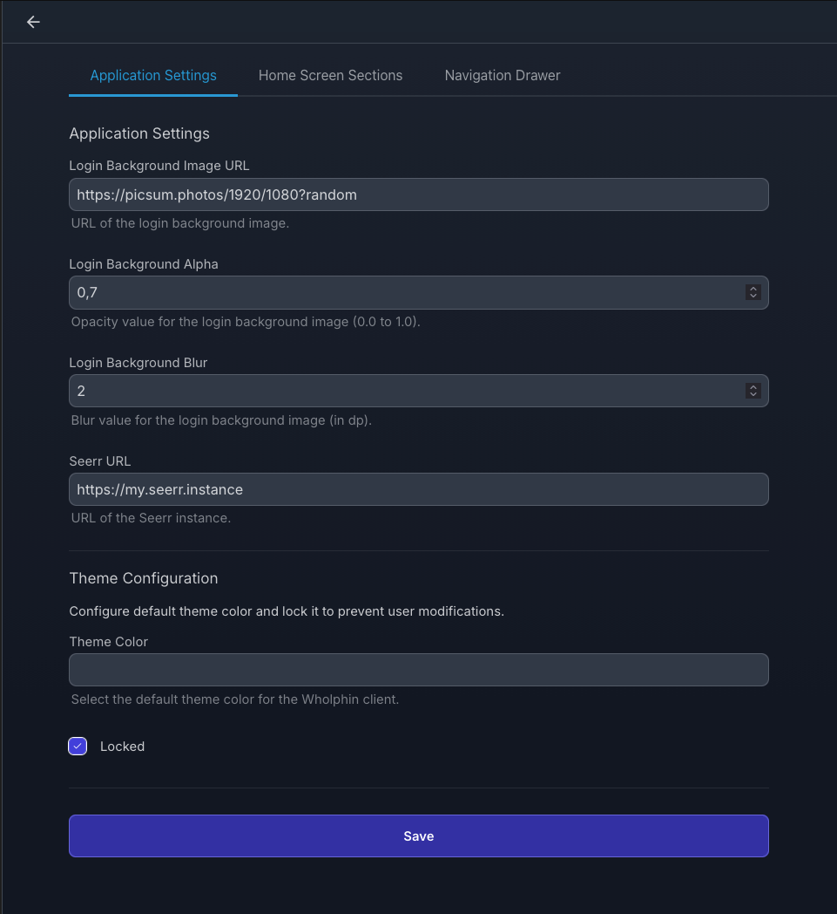
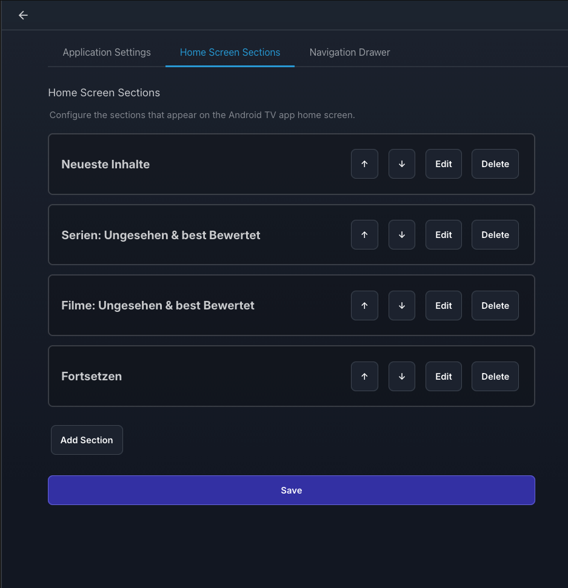
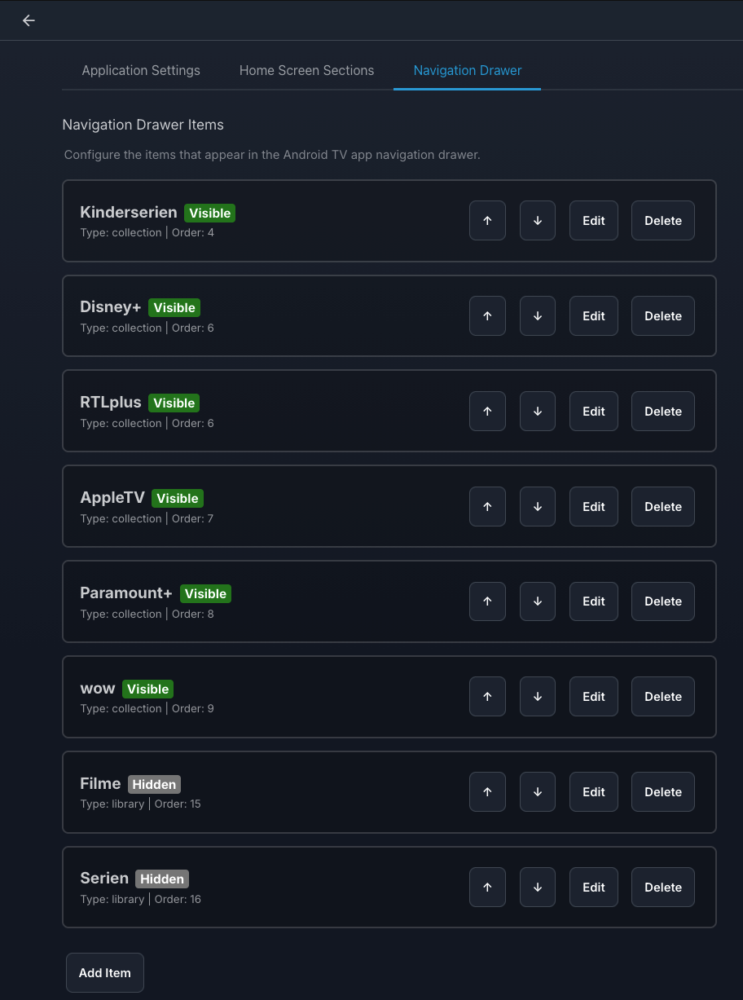

## Getting Started
After the plugin is installed, on your Jellyfin Server navigate to **My Plugins** -> **Wholphin** - there you can adjust everything to your needs.

### Application Settings

### Home Screen Sections

### Navigation Drawer Items

> [!TIP]
> If you like to automatically create BoxSet´s/Collections based on Streaming provider check out (jellyfin-provider-stuff)[https://github.com/kamilkosek/jellyfin-plugin-provider-stuff]

